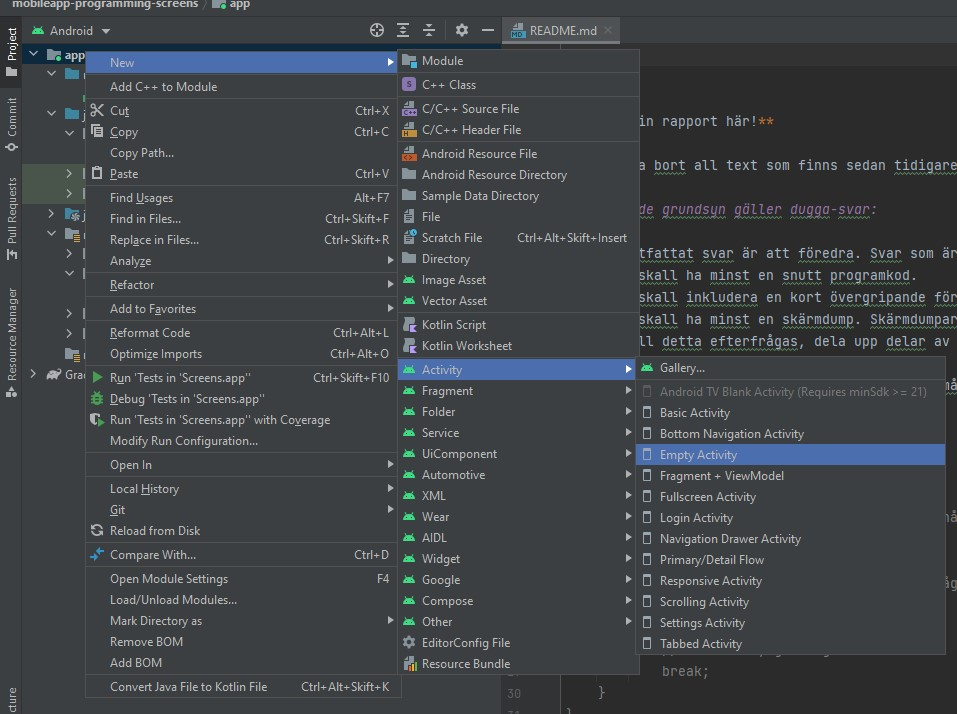

# Rapport

En ny aktivitet skapades 



Efter att denna aktivitet skapades erhölls följande error meddelande vid startandet av applikationen `AAPT: error: resource android:color/system neutral 1_1000 not found.`, detta löstes genom att i `build.gradel (Module:Screens.app)` göra dessa ändringar.


```
android {
    compileSdkVersion 31                /// ändrad från 30 till 31
    buildToolsVersion "30.0.3"

    defaultConfig {
        applicationId "com.example.screens"
        minSdkVersion 16
        targetSdkVersion 31             /// ändrad från 30 till 31
        versionCode 1
        versionName "1.0"

        testInstrumentationRunner "androidx.test.runner.AndroidJUnitRunner"
    }
```

En knapp widget skapas i activity_main.xml genom följande kod, den textview som tidigare fanns i filen raderades. Vidare initieras knappen i `MainActivity.java`.

```
<Button
        android:id="@+id/get2activity2"                     // ger knappen ett ID som kommer användas senare 
        android:layout_width="wrap_content"
        android:layout_height="wrap_content"
        android:text="@string/tap_to_go_to_second_activity" // sätter den text som står på knappen 
        app:layout_constraintBottom_toBottomOf="parent"
        app:layout_constraintEnd_toEndOf="parent"
        app:layout_constraintStart_toStartOf="parent"
        app:layout_constraintTop_toTopOf="parent"
        android:layout_marginTop="250dp"/>                  // sänker knappen 250dp från toppen av skärmen 
```
```
public class MainActivity extends AppCompatActivity {

    Button toSecondActivity;                                    // en knapp skapas

    @Override
    protected void onCreate(Bundle savedInstanceState) {
        super.onCreate(savedInstanceState);
        setContentView(R.layout.activity_main);
        
        toSecondActivity = findViewById(R.id.get2activity2);    // knappen associeras till knapp widgeten via dess ID
    }
}
```

En lyssnare för knappen skapas, där den vid regestrering av knapptryck skickar ett metodanrop till `onButtonTap` varvid en intent skapas och ett string värde kopplas till det. 

```
toSecondActivity.setOnClickListener(new View.OnClickListener() {   // en lyssnare för knappen initieras
            @Override
            public void onClick(View view) {
                onButtonTap();                 // skickar ett metod anropp till metoden som skickar intent
            }
        });
```
```
 private void onButtonTap(){
        Intent intent = new Intent (this, SecondActivity.class); // här skappas en intent som agerar från DENNA klass, och öppnar klassen SecondActivity.class
        intent.putExtra("NAME", "Jean-Paul Hanna"); // här skickas en sträng med NYCKEL "NAME", vid mottagar sidan måste samma nyckel anges
        startActivity(intent); // intenten activeras!!
    }
```
Det fortsatta arbetet utförs i `activity_second.xml` där en textView skapas som senare tar emot text strängen skickat från _MainActivity_ via intenten. 

```
<TextView
    android:id="@+id/secondactivity"                // ID för att hitta denna textView senare
    tools:text="this is text"                       // en temporär text, som inte kommer att synnas i applicationen, den text som kommer synnas är den sträng som skickas via intenten 
    android:layout_width="match_parent"
    android:layout_height="match_parent"
    app:layout_constraintBottom_toBottomOf="parent"
    app:layout_constraintEnd_toEndOf="parent"
    app:layout_constraintStart_toStartOf="parent"
    app:layout_constraintTop_toTopOf="parent"
    android:gravity="center"                        // centrerar texten i mitten av skärmen
    />
```
```
public class SecondActivity extends AppCompatActivity {
    TextView textView;                                                   // en TextView deklareras 

    @Override
    protected void onCreate(Bundle savedInstanceState) {
        super.onCreate(savedInstanceState);
        setContentView(R.layout.activity_second);

        Bundle extras = getIntent().getExtras();                        // Här initieras en "Bundle", denna kommer användas för att ta emot data from en intent.
       
        textView = (TextView) findViewById(R.id.secondactivity);        // TextViewn initieras genom det ID som skapades innan 
        textView.setText(extras.getString("NAME"));                     // en text sträng sätts i textViewn taget från variabeln extras (Bundle) som i sin tur
                                                                        // fått denna sträng vid skapandet av intenten som öppna denna sida 
    }
}
```
**Skriv din rapport här!**

_Du kan ta bort all text som finns sedan tidigare_.

## Följande grundsyn gäller dugga-svar:

- Ett kortfattat svar är att föredra. Svar som är längre än en sida text (skärmdumpar och programkod exkluderat) är onödigt långt.
- Svaret skall ha minst en snutt programkod.
- Svaret skall inkludera en kort övergripande förklarande text som redogör för vad respektive snutt programkod gör eller som svarar på annan teorifråga.
- Svaret skall ha minst en skärmdump. Skärmdumpar skall illustrera exekvering av relevant programkod. Eventuell text i skärmdumpar måste vara läsbar.
- I de fall detta efterfrågas, dela upp delar av ditt svar i för- och nackdelar. Dina för- respektive nackdelar skall vara i form av punktlistor med kortare stycken (3-4 meningar).

Programkod ska se ut som exemplet nedan. Koden måste vara korrekt indenterad då den blir lättare att läsa vilket gör det lättare att hitta syntaktiska fel.

```
function errorCallback(error) {
    switch(error.code) {
        case error.PERMISSION_DENIED:
            // Geolocation API stöds inte, gör något
            break;
        case error.POSITION_UNAVAILABLE:
            // Misslyckat positionsanrop, gör något
            break;
        case error.UNKNOWN_ERROR:
            // Okänt fel, gör något
            break;
    }
}
```

Bilder läggs i samma mapp som markdown-filen.


Läs gärna:

- Boulos, M.N.K., Warren, J., Gong, J. & Yue, P. (2010) Web GIS in practice VIII: HTML5 and the canvas element for interactive online mapping. International journal of health geographics 9, 14. Shin, Y. &
- Wunsche, B.C. (2013) A smartphone-based golf simulation exercise game for supporting arthritis patients. 2013 28th International Conference of Image and Vision Computing New Zealand (IVCNZ), IEEE, pp. 459–464.
- Wohlin, C., Runeson, P., Höst, M., Ohlsson, M.C., Regnell, B., Wesslén, A. (2012) Experimentation in Software Engineering, Berlin, Heidelberg: Springer Berlin Heidelberg.
